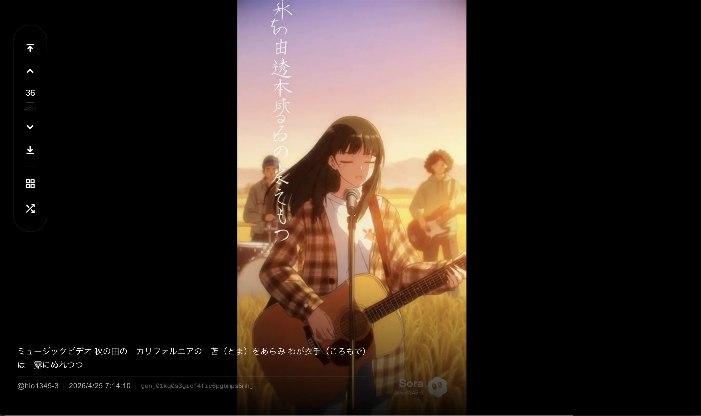

# Hio1345 Sora Player




Sora2のエクスポートファイルをローカルで閲覧するための動画プレイヤー。

## 特徴
- **Sora特化**: 生成動画の視聴に最適化したフル画面インターフェースとプロンプト表示
- **ナビゲーション**: 修飾キーによる10/100件単位のスキップ、最初/最後へのジャンプ、および番号入力による移動に対応
- **ギャラリー機能**: 全動画をサムネイルで一覧表示し、視覚的に動画を選択可能
- **検索機能**: ギャラリー内でプロンプトやアカウント名による絞り込みが可能。検索中は検索結果だけを再生対象にできます
- **タグ機能**: ギャラリーで複数の動画を選択し、ローカル保存のタグを一括追加できます。タグをクリックすると該当動画だけに絞り込め、再生画面でも現在の動画に付いたタグを確認できます
- **マルチ操作**: スワイプ、マウスホイール、キーボード入力に対応
- **フォルダ連携**: 視聴中の動画の保存先フォルダをワンクリックで Finder で表示可能

## 準備
1. **ダウンロード**: このページの右上にある緑色の「Code」ボタンをクリックし、「Download ZIP」を選択して保存・解凍してください。
2. **Node.js**: [公式サイト](https://nodejs.org/)から「推奨版 (LTS)」をダウンロードしてインストールしてください。
3. **動画の配置**: `videos/` フォルダに、Sora からエクスポートした動画データを以下の構成で配置してください。

   ```text
   videos/
     ├── User_A/                (1) アカウント名でフォルダを作成
     │   ├── sora-data-files-export-1/  (2) Sora からのエクスポートフォルダ
     │   ├── sora-data-files-export-2/
     │   └── ...
     ├── User_B/                (3) 複数アカウントがある場合は同様に作成
     │   └── sora-data-files-export-1/
     └── ...
   ```

4. **設定 (任意)**: デフォルトではプロジェクト内の `videos/` フォルダを参照しますが、以下の手順で任意の場所にある動画ライブラリを参照できます。
   1. `config.json.example` を `config.json` という名前でコピーします。
   2. `config.json` をテキストエディタで開き、`videosDir` の値を動画フォルダのパス（絶対パスまたは相対パス）に書き換えます。
   3. アプリを再起動すると設定が反映されます。

## 起動

### 最も簡単な方法
1. 各OSに合わせて以下のファイルをダブルクリックします。
   - **Mac**: `start.command`
   - **Windows**: `start.bat`
2. 自動的にブラウザが開き、プレイヤーが表示されます。
   （開かない場合はブラウザで `http://localhost:3000` を開いてください）
3. 起動直後はギャラリーが全動画表示で開きます。

### コマンドラインでの起動
1. 依存関係のインストールと起動
   ```bash
   npm install
   npm run dev
   ```
2. 別のターミナルでブラウザを開く
   ```bash
   npm run open
   ```

## 終了
実行画面（ターミナルやコマンドプロンプト）のウィンドウを閉じてください。

## 基本操作
- **操作パネルの表示**: 画面左側 40% または画面下部 40% にカーソルを移動すると表示
- **画面左上の矢印ボタン**:
  - `⤒` : 一番最初（最新）の動画へジャンプ
  - `↑` : 前の動画へ戻る
  - `↓` : 次の動画へ進む
  - `⤓` : 一番最後（最古）の動画へジャンプ
- **↑ / ↓ キー / スワイプ**: 動画の切り替え
  - 先頭または末尾でさらに移動すると、反対側へループします
  - `Shift` + `↑ / ↓`: 10件スキップ。端を超える場合はいったん端で止まり、端でもう一度押すと反対側へループします
  - `Command` + `↑ / ↓`: 100件スキップ。端を超える場合はいったん端で止まり、端でもう一度押すと反対側へループします
  - `Shift` + `Command` + `↑ / ↓`: 最初 / 最後へジャンプ
- **/ キー**: 検索ギャラリー（サムネイル一覧）を表示。表示中は検索バーにフォーカス
- **M キー**: ミュート（消音）の切り替え
- **F キー**: フルスクリーン表示の切り替え
- **R キー**: ランダムな動画へジャンプ
- **? キー**: ショートカット一覧の表示 / 非表示
- **動画番号をクリック**: 番号を直接入力してジャンプ（入力後Enterで確定）
- **プロンプト内のカメオ検索**: `@hio1345-3.1` のようなカメオ表記をクリックすると、その文字列で検索したギャラリーを表示します
- **再生画面のタグ表示**: タグが付いた動画では、プロンプト下にタグが表示されます。タグをクリックすると、そのタグで絞り込んだギャラリーを表示します
- **検索ボタン（虫眼鏡アイコン）**: サムネイル一覧を表示して検索バーにフォーカス
  - 起動直後またはギャラリーを開くと、全動画表示で検索バーに自動フォーカスします
  - ギャラリー上部の `Sora2 Player` をクリックすると、検索・タグ選択を解除して全動画表示の先頭に戻ります
  - サムネイルクリックでその動画へジャンプ
  - サムネイル左上のチェックをクリックするとタグ付け対象として選択できます
  - サムネイル左上のチェックからドラッグすると、起点から終点までの連続した動画をまとめて選択/解除できます
  - 動画を選択すると、画面下部の検索バーがタグ編集バーに切り替わります
  - タグ編集バーの上段に既存タグがチップとして表示されます
  - **1件選択時**（トグル編集）: チップをクリックしてタグのオン/オフを切り替え、「確定」で上書き保存
  - **複数選択時**（追加専用）: チップをクリックまたは入力欄で新しいタグを追加し、「追加」で一括付与
  - テキスト入力欄で新しいタグを追加できます（カンマ区切りで複数対応）
  - ギャラリー上部のタグをクリックすると、そのタグが付いた動画だけに絞り込めます
  - 画面下部にカーソルを移動すると検索バーが表示され、プロンプト等で絞り込みが可能
  - 検索バーで `Enter` を押すと、検索結果の先頭から再生します。空欄の場合は全動画モードで再生し、結果がない場合はギャラリーを閉じません
  - 検索中にサムネイルを選ぶと、その検索結果だけを対象に前後移動・ランダム再生・番号ジャンプができます
  - 選択中に `Esc` キーを押すと選択を解除します。未選択時は `Esc` キーまたは背景クリックで閉じます
- **Space キー**: 再生 / 一時停止
- **画面右下のファイル名をクリック**: その動画が保存されているフォルダを Finder で開く

## うまくいかない時は？
- **エラーが出る、または変更が反映されない**: 
  一度開いている実行画面（ターミナルやコマンドプロンプト）をすべて閉じてから、もう一度 `start.command` または `start.bat` を実行してください。

## ローカルデータ
- タグ情報は `data/tags.json` に保存されます。
- `data/tags.json` はローカル個人データとして Git の管理対象外です。バックアップしたい場合はこのファイルをコピーしてください。

## 補足
@hio1345は作者のSora2アカウント名でした

## ライセンス
[MIT License](LICENSE)
