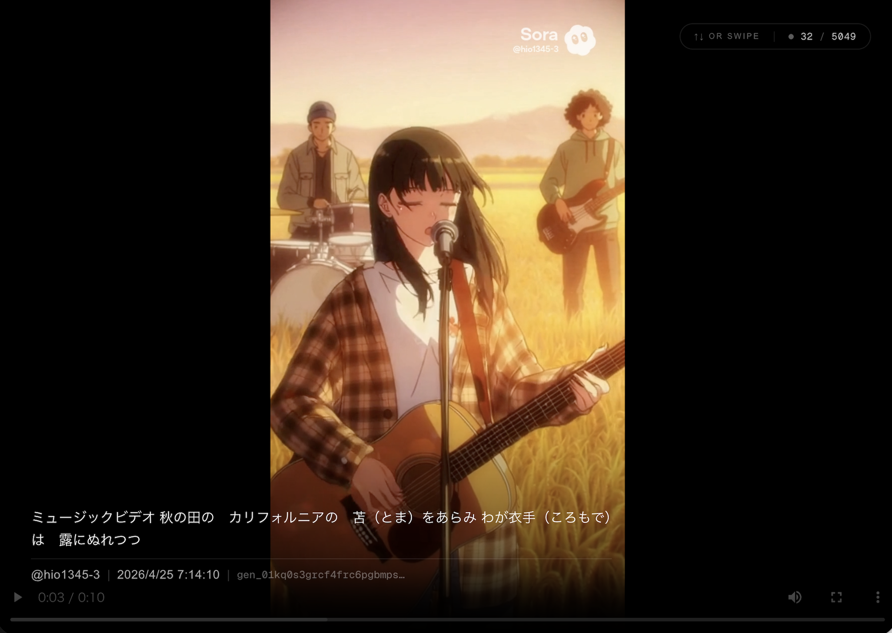

# Hio1345 Sora Player




Sora2のエクスポートファイルをローカルで閲覧するための動画プレイヤー。

## 準備
1. **ダウンロード**: このページの右上にある緑色の「Code」ボタンをクリックし、「Download ZIP」を選択して保存・解凍してください。
2. **Node.js**: [公式サイト](https://nodejs.org/)から「推奨版 (LTS)」をダウンロードしてインストールしてください。
3. **動画の配置**: `videos/` フォルダに、Sora からエクスポートした動画データを以下の構成で配置してください。

   ```text
   videos/
     ├── User_A/                (1) アカウント名でフォルダを作成
     │   ├── sora-data-files-export-1/  (2) Sora からのエクスポートフォルダ
     │   ├── sora-data-files-export-2/
     │   └── ...
     ├── User_B/                (3) 複数アカウントがある場合は同様に作成
     │   └── sora-data-files-export-1/
     └── ...
   ```

## 起動

### 最も簡単な方法
1. 各OSに合わせて以下のファイルをダブルクリックします。
   - **Mac**: `start.command`
   - **Windows**: `start.bat`
2. 自動的にブラウザが開き、プレイヤーが表示されます。
   （開かない場合はブラウザで `http://localhost:3000` を開いてください）

### コマンドラインでの起動
1. 依存関係のインストールと起動
   ```bash
   npm install
   npm run dev
   ```
2. 別のターミナルでブラウザを開く
   ```bash
   npm run open
   ```

## 基本操作
- **↑ / ↓ / スワイプ**: 動画の切り替え
- **Space**: 再生 / 一時停止

## 補足
@hio1345は作者のSora2アカウント名でした

## うまくいかない時は？
- **エラーが出る、または変更が反映されない**: 
  一度開いている実行画面（ターミナルやコマンドプロンプト）をすべて閉じてから、もう一度 `start.command` または `start.bat` を実行してください。

## ライセンス
[MIT License](LICENSE)
